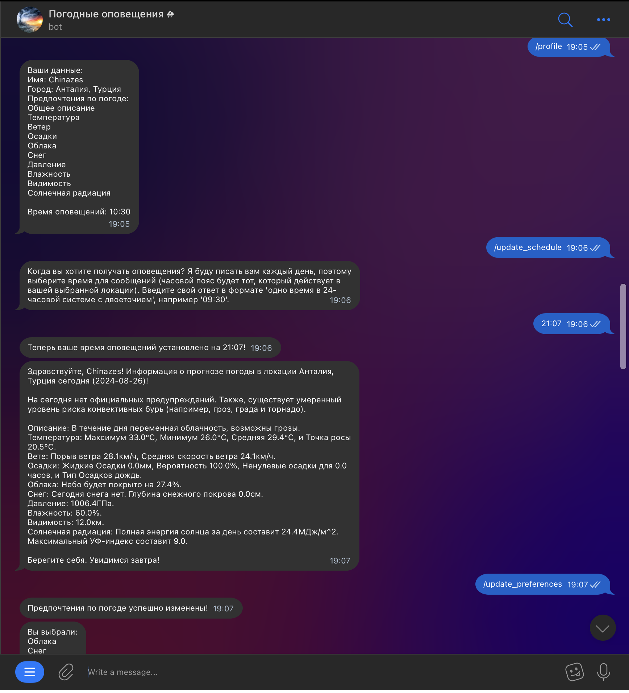

# Weather Alert Telegram Bot

A Telegram bot with 100+ active users that delivers personalised daily weather forecasts and safety alerts. This project was developed and deployed to help users monitor weather conditions and receive timely notifications tailored to their preferences. The bot is fully automated and hosted online for continuous operation.

## Features
- Interactive onboarding dialogue to collect:
    - Name
    - Location
    - Weather preferences
    - Preferred notification time
- Personalised daily weather notifications
- Extreme weather alerts filtered by user preferences
- Editable user settings via in-chat keyboard menu
- Persistent data storage using SQL database

## Tech Stack
- Python
- Asynchronous programming
- sqlite3
- requests
- datetime
- geopy
- telegram.ext
- PythonAnywhere (deployment & hosting)

## How It Works
1. The bot initiates a dialogue to collect user details.
2. Data is stored in a custom SQL database.
3. Users can update preferences via the inbuilt Telegram keyboard menu.
4. At the scheduled time, the bot:
    - Calls a weather API
    - Retrieves forecasts and extreme weather alerts
    - Filters data based on user preferences
    - Sends a personalised notification

## Preview
